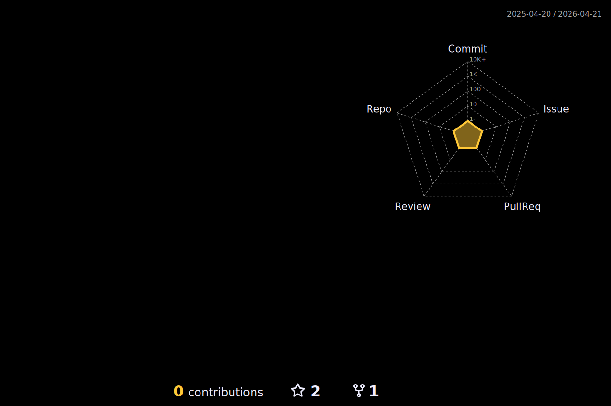

### Hi there 👋 I'm Kenta Suzuki

- ✏️ I’m in the 1st year of a Master's degree in Computer Science.
- 🏢 I done an internship as a data analyst at DYNAMIC PLUS CO., LTD (3 months).
- 📊 I’m mainly learning ... Python, Machine Learning, Data Analysis.
- 👨‍💻 I wanna be a Data Scientist(Data Analyst) or a Machine Learning Engineer.
- 🍎 My computer is ... MacBook Pro (15-inch, 2019).
- 🐢 For more detailed information: Wantedly [https://www.wantedly.com/id/semlele]

 
  
  
  <//qiita.com/semlele">
    
  </a>

  
  

